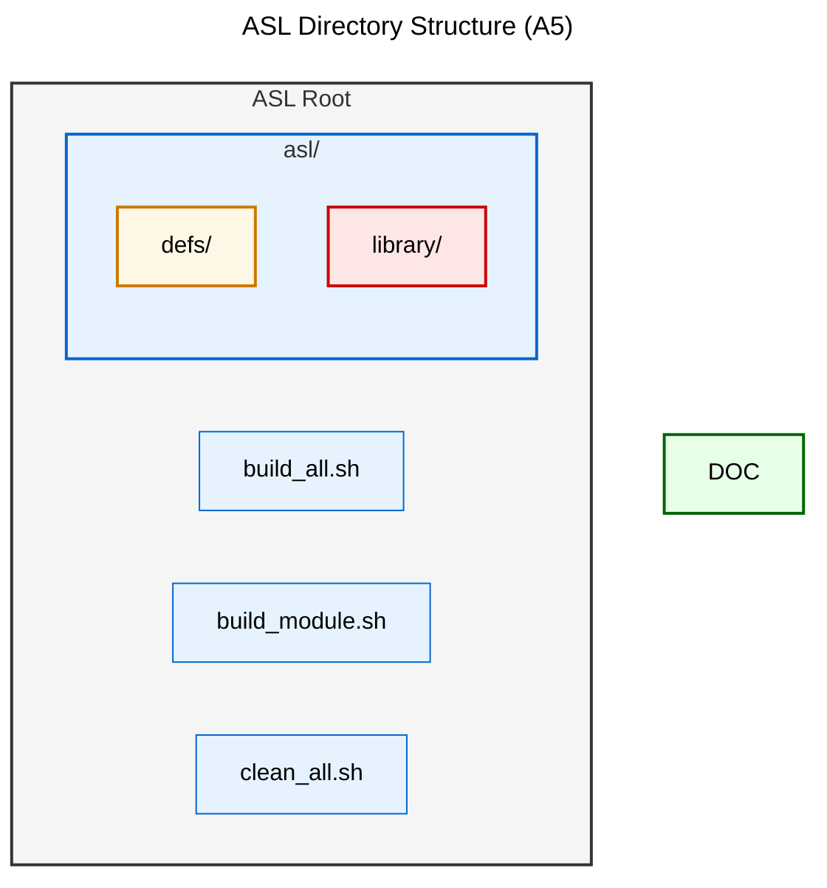
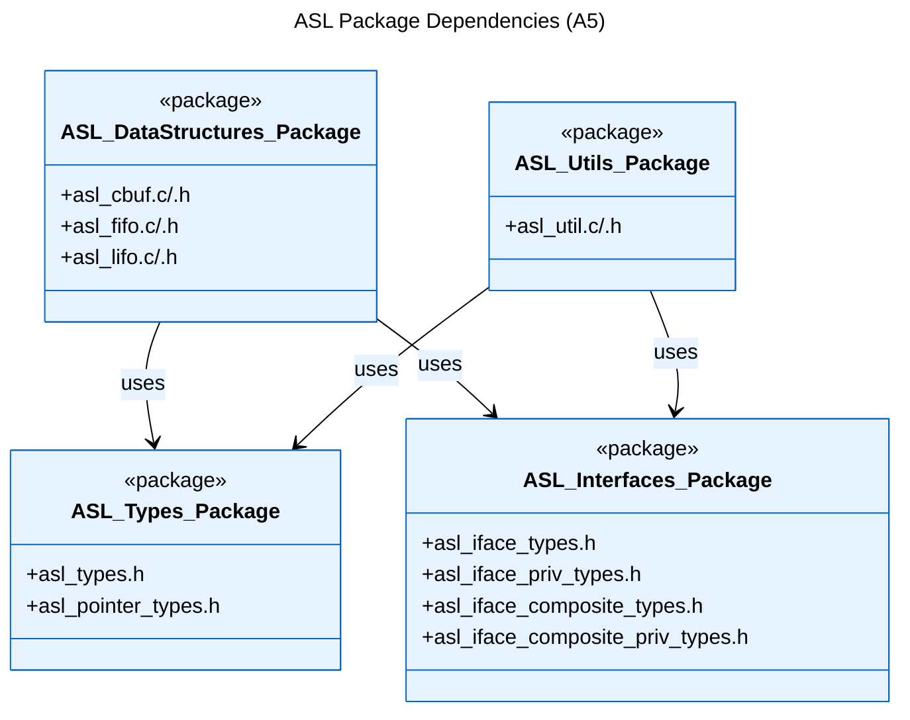
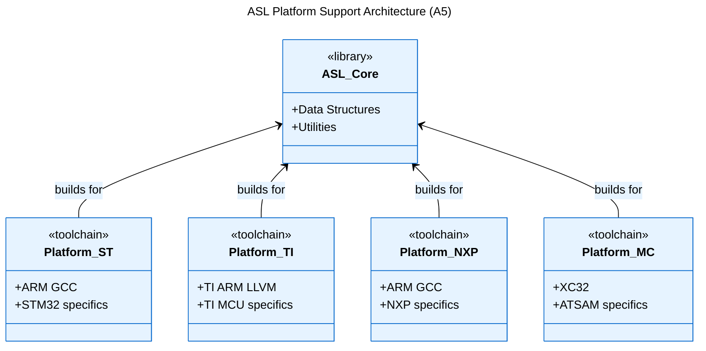

[Logical View](logical_view.md) | [Development View](development_view.md) | [Process View](process_view.md) | [Physical View](physical_view.md) | [Scenarios](scenarios.md)

---

# Development View

## Table of Contents
- [1. Overview](#1-overview)
- [2. Directory Structure](#2-directory-structure)
- [3. Package Organization](#3-package-organization)
- [4. Build System](#4-build-system)
- [5. Platform Support](#5-platform-support)
- [6. Dependencies](#6-dependencies)
- [7. References](#7-references)

---

## 1. Overview

The Development View organizes the ASL codebase into clear layers: type definitions, library implementations, and build system integration. This structure enables clean separation of interfaces and implementations while supporting multiple platforms.

## 2. Directory Structure

## 3. Package Organization

## 4. Build System

The ASL build system supports multiple platforms through a flexible toolchain configuration:

- **Build Scripts**:
  - `build_all.sh`: Builds for all supported platforms
  - `build_module.sh`: Platform-specific build script
  - `clean_all.sh`: Cleanup script

- **Supported Platforms**:
  - STM32 (ARM)
  - TI MCU
  - NXP MCU
  - Microchip MCU
  - Default (x86_64)

- **Build Process**:
  1. Toolchain setup
  2. Source preparation
  3. Compilation
  4. Library creation
  5. Export & packaging

## 5. Platform Support

## 6. Dependencies

ASL is designed to be self-contained with minimal external dependencies:

- **Required**:
  - Standard C library
  - Platform toolchain
  - Build shell environment

- **Optional**:
  - None currently

## 7. References

### Implementation Files
- Source Tree: `asl/` directory
- Build Scripts: Root directory
- Platform Toolchains: As configured in `build_module.sh`

### Related Views
- [Logical View](logical_view.md) - Component structure and relationships
- [Process View](process_view.md) - Runtime dependencies
- [Physical View](physical_view.md) - Platform-specific builds

### Documentation Hub
- [Architecture Home](README.md) - Documentation structure and navigation
