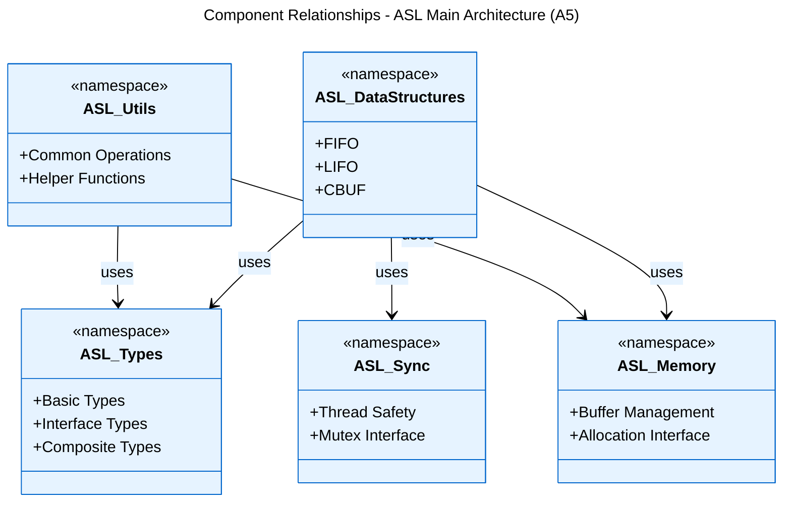

[Logical View](logical_view.md) | [Development View](development_view.md) | [Process View](process_view.md) | [Physical View](physical_view.md) | [Scenarios](scenarios.md)

---

# Logical View

## Table of Contents
- [1. Main Components](#1-main-components)
- [2. Component Relationships](#2-component-relationships)
- [3. Core Type System](#3-core-type-system)
- [4. Module Documentation](#4-module-documentation)
- [5. Interface Architecture](#5-interface-architecture)
- [6. Cross-Module Features](#6-cross-module-features)
- [7. References](#7-references)

---

This document outlines the ASL system's main abstractions and their relationships.

## 1. Main Components

- **Type System**: Core types and interfaces
- **Data Structures**: FIFO, LIFO, CBUF implementations
- **Memory Management**: Allocation and buffer handling
- **Synchronization**: Thread-safety primitives
- **Utilities**: Common operations and helpers

## 2. Component Relationships

## 3. Core Type System

The ASL implements a comprehensive type system that provides:
- Standard C99 derived types
- Platform-independent pointer types
- Function pointer interfaces
- Composite type definitions

For detailed type system documentation, see [Core Types](logical_view_types.md).

## 4. Module Documentation

Each core module is documented in detail in its own file to maintain readability:

- **[CBUF Module](logical_view_cbuf.md)**: Circular Buffer
  - Generic 8-bit data circular buffer
  - Producer-consumer thread safety
  - Memory efficient implementation

- **[FIFO Module](logical_view_fifo.md)**: First-In-First-Out Queue
  - Generic fixed-size element FIFO
  - Thread-safe producer-consumer pattern
  - Dynamic memory support
  
- **[LIFO Module](logical_view_lifo.md)**: Last-In-First-Out Stack
  - Generic stack implementation
  - Fixed or dynamic sizing options
  - Thread safety support
  
- **[Utilities](logical_view_util.md)**: Common Functions
  - Buffer operations
  - Memory manipulation
  - Helper functions

## 5. Interface Architecture

ASL uses a layered interface approach:
- Base interfaces for primitive operations
- Composite interfaces for complex operations
- Private interfaces for internal use
- Public interfaces for library users

This separation enables:
- Clean API boundaries
- Implementation flexibility
- Platform independence
- Future extensibility

## 6. Cross-Module Features

Common features across all modules:
- Thread safety mechanisms
- Memory management patterns
- Error handling approach
- Type system integration
- Platform abstraction

## 7. References

### Implementation Files
- ASL Source Code: `asl/` directory
- Build System: `build_module.sh`, `build_all.sh`
- Platform Configurations: Supported toolchains in build scripts

### Related Views
- [Development View](development_view.md) - Code organization and build process
- [Process View](process_view.md) - Runtime behavior and threading
- [Physical View](physical_view.md) - Platform deployment
- [Scenarios](scenarios.md) - Usage examples and patterns

### Documentation Hub
- [Architecture Home](README.md) - Documentation structure and navigation
