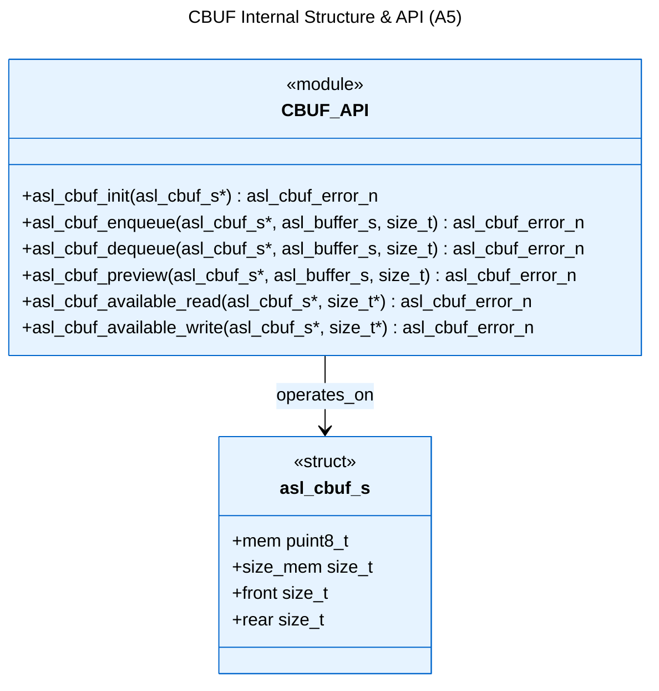
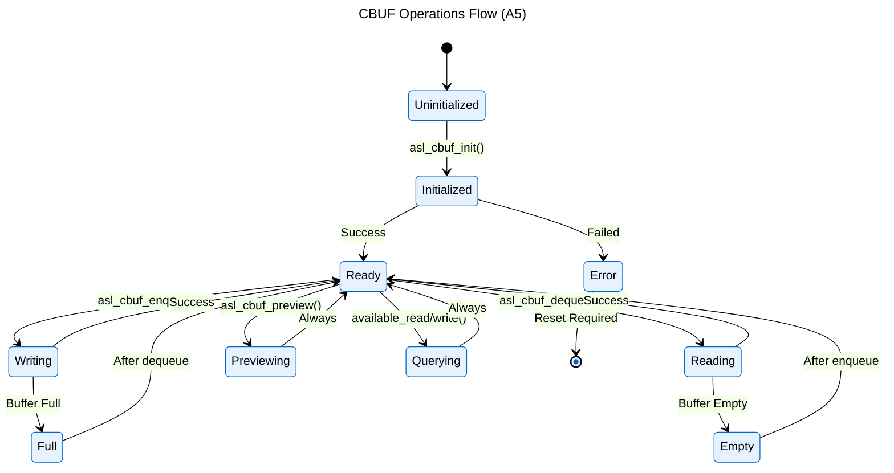

# Logical View: CBUF Overview & Structure

**Parent:** [CBUF Module Hub](logical_view_cbuf.md) | [Logical View](logical_view.md) | [Architecture Home](README.md)

## Table of Contents
- [1. Overview](#1-overview)
- [2. Structure](#2-structure)
- [3. Operations](#3-operations)
- [4. References](#4-references)

---

## 1. Overview

The Circular Buffer (CBUF) module implements a generic 8-bit data circular buffer with thread-safe producer-consumer operations.

**Key Features**:
- **Generic 8-bit storage**: Handles any data type as byte arrays
- **Thread-safe operations**: Built-in synchronization for concurrent access
- **Zero-copy preview**: Inspect data without removing from buffer
- **Dynamic sizing**: Configurable buffer size during initialization
- **Error resilience**: Comprehensive error handling and recovery

**Use Cases**:
- Serial communication buffering
- Producer-consumer data pipelines
- Streaming data processing
- Inter-thread communication

---

## 2. Structure



**Data Members**:
- `mem`: Pointer to buffer memory (8-bit oriented)
- `size_mem`: Total buffer size in bytes
- `front`: Read position index
- `rear`: Write position index

**Memory Layout**:
```
[0] [1] [2] [3] [4] [5] [6] [7] ...
 ^                   ^
front              rear
```

---

## 3. Operations



**Operation Types**:
1. **Initialization**: Setup buffer with memory allocation
2. **Data Write**: Add data to buffer (enqueue)
3. **Data Read**: Remove data from buffer (dequeue)
4. **Data Preview**: Inspect data without removal
5. **Status Query**: Check available space/data

---

## 4. References

### Detailed Documentation
- [Thread Safety](logical_view_cbuf_threading.md) - Concurrency and synchronization

### Implementation Files
- **Header**: `asl/library/asl_cbuf.h` - Function declarations
- **Source**: `asl/library/asl_cbuf.c` - Implementation

### Related Modules  
- [FIFO](logical_view_fifo.md) - First-in-first-out queue implementation
- [LIFO](logical_view_lifo.md) - Last-in-first-out stack implementation
- [Types](logical_view_types.md) - ASL type system
