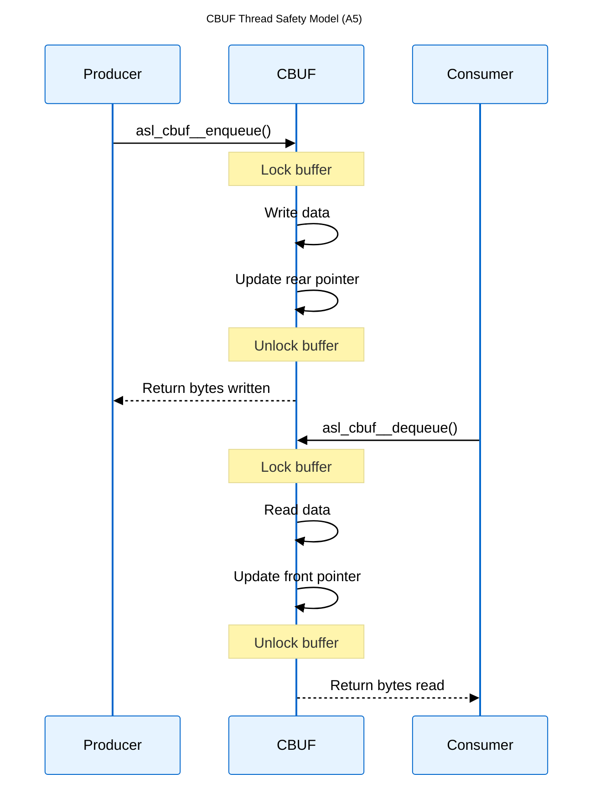

# Logical View: CBUF Thread Safety & Error Handling

**Parent:** [CBUF Module Hub](logical_view_cbuf.md) | [Logical View](logical_view.md) | [Architecture Home](README.md)

## Table of Contents
- [1. Thread Safety](#1-thread-safety)
- [2. Error Handling](#2-error-handling)
- [3. Error Recovery](#3-error-recovery)
- [4. References](#4-references)

---

## 1. Thread Safety

### 1.1 Thread Safety Model

The CBUF implementation provides thread-safe operations for concurrent producer-consumer scenarios.



### 1.2 Synchronization Mechanism

**Internal Locking**:
- Each CBUF instance contains internal synchronization
- Automatic lock acquisition/release for all operations
- Reader-writer compatible (multiple readers, single writer)

**Critical Sections**:
```c
// Pseudo-code showing internal locking
size_t asl_cbuf__enqueue(asl_cbuf_s* cbuf, const puint8_t data, size_t data_size) {
    ACQUIRE_LOCK(cbuf->mutex);
    
    // Critical section
    size_t written = internal_enqueue(cbuf, data, data_size);
    
    RELEASE_LOCK(cbuf->mutex);
    return written;
}
```

### 1.3 Multi-Producer/Multi-Consumer

**Safe Patterns**:
- Multiple producers writing to different buffers: ✓ Safe
- Multiple consumers reading from different buffers: ✓ Safe  
- Single producer, multiple consumers on same buffer: ✓ Safe
- Multiple producers, single consumer on same buffer: ✓ Safe

**Unsafe Patterns**:
- Direct memory access bypassing API: ✗ Unsafe
- External pointer manipulation: ✗ Unsafe

---

## 2. Error Handling

### 2.1 Error Code System

The CBUF module uses size-based return values and parameter validation for error indication.

**Return Value Conventions**:
```c
// Boolean functions
bool result = asl_cbuf__init(cbuf, mem, size);
// true: Success, false: Error

// Size functions  
size_t bytes = asl_cbuf__enqueue(cbuf, data, size);
// Returns actual bytes processed (0-size)
```

### 2.2 Error Conditions

**Initialization Errors**:
- NULL pointer parameters
- Zero or invalid memory size
- Already initialized buffer

**Runtime Errors**:
- Buffer overflow (handled gracefully)
- Buffer underflow (handled gracefully)
- Invalid buffer state

### 2.3 Key Considerations

**Thread Safety**: External synchronization required
**Error Handling**: Size-based returns with parameter validation
**Recovery**: Graceful degradation with partial operations

---

## 3. References

### Related Documentation
- [CBUF Overview](logical_view_cbuf_overview.md) - Basic structure and concepts

### Implementation Files
- **Header**: `asl/library/asl_cbuf.h` - Function declarations
- **Source**: `asl/library/asl_cbuf.c` - Implementation with error handling

### Threading Standards
- **POSIX Threads**: pthread_mutex_t for synchronization
- **C11 Threads**: mtx_t for modern C threading
- **Platform Specific**: Windows CRITICAL_SECTION, etc.

### Best Practices
- Always check return values
- Implement timeout mechanisms for blocking operations
- Use validation functions in debug builds
- Monitor buffer utilization for performance tuning
