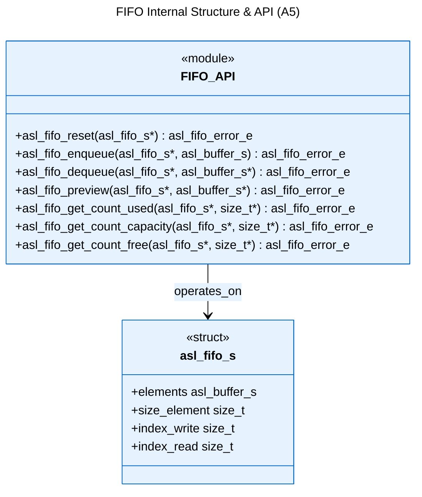
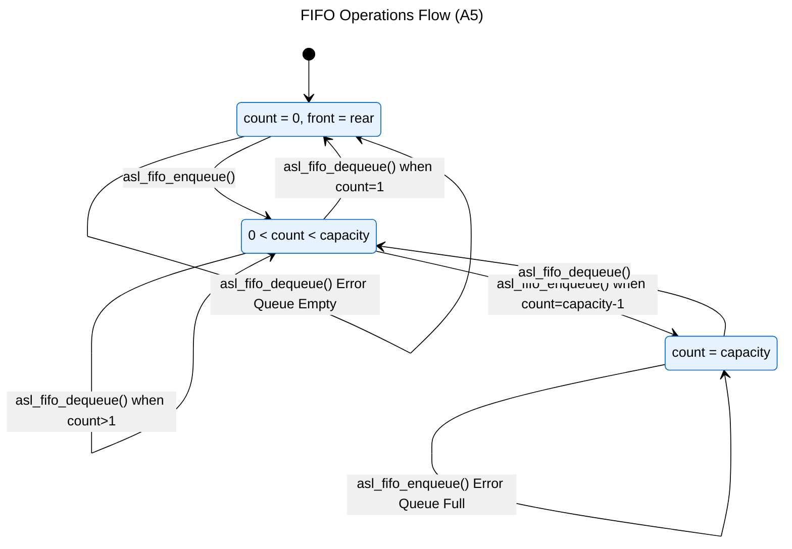

# Logical View: FIFO Overview & Structure

**Parent:** [FIFO Module Hub](logical_view_fifo.md) | [Logical View](logical_view.md) | [Architecture Home](README.md)

## Table of Contents
- [1. Overview](#1-overview)
- [2. Structure](#2-structure)
- [3. Operations](#3-operations)
- [4. References](#4-references)

---

## 1. Overview

The First-In-First-Out (FIFO) module implements a generic queue data structure with 8-bit element storage and configurable capacity.

**Key Features**:
- **Generic 8-bit storage**: Handles any data type as byte arrays
- **Queue semantics**: First-in-first-out ordering
- **Fixed capacity**: Configurable maximum element count
- **Zero-copy peek**: Inspect front element without removal
- **Efficient operation**: Optimized for producer-consumer scenarios

**Use Cases**:
- Task queues and job scheduling
- Producer-consumer pipelines
- Message passing systems
- Event handling queues
- Buffered I/O operations

---

## 2. Structure



**Data Members**:
- `elements`: Buffer storing actual elements of FIFO (asl_buffer_s)
- `size_element`: Size in bytes of a single element in the FIFO
- `index_write`: Write index of circular queue (used by producer during enqueue)
- `index_read`: Read index of circular queue (used by consumer during preview/dequeue)

**Memory Layout**:
```
Circular FIFO Layout:
elements.mem -> [0][1][2][3][4][5][6][7]...
                 ^         ^
            index_read  index_write
                 |         |
                 v         v
               [E1][E2][E3][  ][  ][  ][  ][  ]
```

---

## 3. Operations



**Operation Types**:
1. **Enqueue**: Add element to rear of queue
2. **Dequeue**: Remove and return front element
3. **Peek**: Inspect front element without removal
4. **Reset**: Clear all elements
5. **Query**: Check capacity, used count, free count

**Queue Invariants**:
- `0 <= index_read < elements.size_mem/size_element`
- `0 <= index_write < elements.size_mem/size_element`
- Element capacity = `elements.size_mem / size_element`
- Front element is at index `index_read`
- Next insertion at index `index_write`

---

## 4. References

### Implementation Files
- **Header**: `asl/library/asl_fifo.h` - Function declarations
- **Source**: `asl/library/asl_fifo.c` - Implementation

### Related Modules
- [LIFO](logical_view_lifo.md) - Last-in-first-out stack implementation
- [CBUF](logical_view_cbuf.md) - Circular buffer implementation
- [Types](logical_view_types.md) - ASL type system
