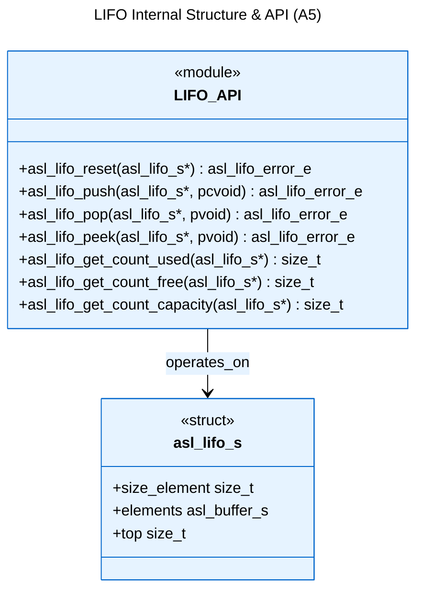
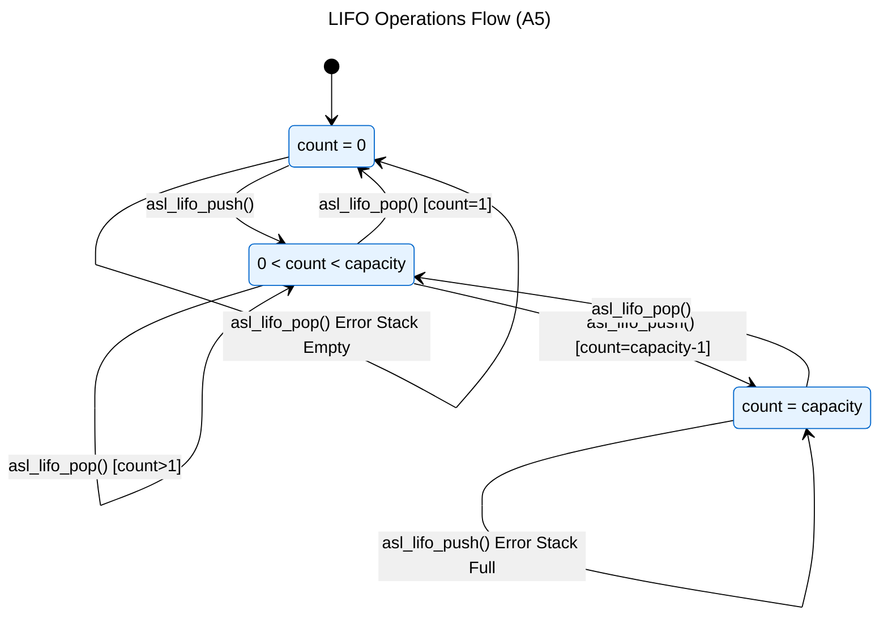

# Logical View: LIFO Overview & Structure

**Parent:** [LIFO Module Hub](logical_view_lifo.md) | [Logical View](logical_view.md) | [Architecture Home](README.md)

## Table of Contents
- [1. Overview](#1-overview)
- [2. Structure](#2-structure)
- [3. Operations](#3-operations)
- [4. References](#4-references)

---

## 1. Overview

The Last-In-First-Out (LIFO) module implements a generic stack data structure with 8-bit element storage and configurable capacity.

**Key Features**:
- **Generic 8-bit storage**: Handles any data type as byte arrays
- **Stack semantics**: Last-in-first-out ordering
- **Fixed capacity**: Configurable maximum element count
- **Zero-copy peek**: Inspect top element without removal
- **Thread-safe operations**: Built-in synchronization support

**Use Cases**:
- Function call stacks
- Undo/redo mechanisms
- Expression evaluation
- Recursive algorithm support
- Temporary data storage

---

## 2. Structure



**Data Members**:
- `size_element`: Size in bytes of a single element in the LIFO
- `elements`: Buffer that stores actual elements of LIFO (asl_buffer_s)
- `top`: Zero base relative 'top' of stack (when top==0, stack is empty)

**Memory Layout**:
```
Stack grows upward:
elements.mem -> [Element 0] <- Bottom (index 0)
                [Element 1]
                [Element 2]
                [Element n] <- Top (index = top-1)
                [  unused  ]
                [  unused  ] <- capacity-1 (elements.size_mem/size_element-1)
```

---

## 3. Operations



**Operation Types**:
1. **Push**: Add element to top of stack
2. **Pop**: Remove and return top element
3. **Peek**: Inspect top element without removal
4. **Reset**: Clear all elements
5. **Query**: Check capacity, used count, free count

**Stack Invariants**:
- `0 <= count <= capacity`
- Top element is at index `count-1`
- Push increases count by 1
- Pop decreases count by 1

---

## 4. References

### Detailed Documentation
- [Thread Safety](logical_view_lifo_threading.md) - Concurrency and error handling

### Implementation Files
- **Header**: `asl/library/asl_lifo.h` - Function declarations
- **Source**: `asl/library/asl_lifo.c` - Implementation

### Related Modules
- [FIFO](logical_view_fifo.md) - First-in-first-out queue implementation
- [CBUF](logical_view_cbuf.md) - Circular buffer implementation
- [Types](logical_view_types.md) - ASL type system
