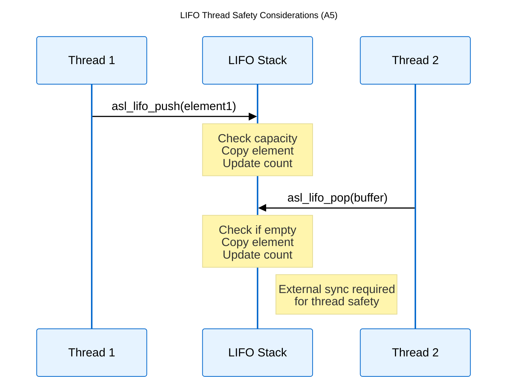
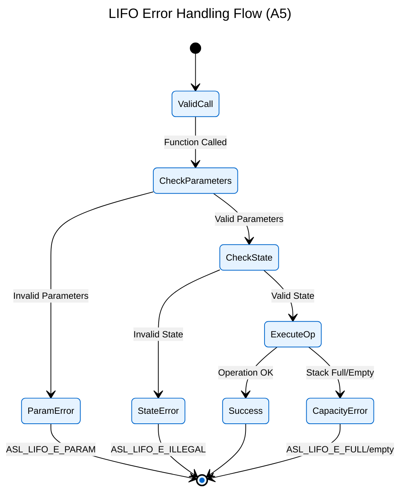

# Logical View: LIFO Thread Safety & Error Handling

**Parent:** [LIFO Module Hub](logical_view_lifo.md) | [Logical View](logical_view.md) | [Architecture Home](README.md)

## Table of Contents
- [1. Thread Safety](#1-thread-safety)
- [2. Error Handling](#2-error-handling)
- [3. Best Practices](#3-best-practices)

---

## 1. Thread Safety

### 1.1 Thread Safety Model

The LIFO implementation provides parameter validation but requires external synchronization for multi-threaded access.



### 1.2 Synchronization Requirements

**External Synchronization Required**: LIFO operations require mutex protection for multi-threaded access.

**Thread-Safe Wrapper Pattern**:
```c
// Example mutex-protected operations
pthread_mutex_lock(&stack_mutex);
result = asl_lifo_push(&stack, data);
pthread_mutex_unlock(&stack_mutex);
```

---

## 2. Error Handling

### 2.1 Error Codes



### 2.2 Error Categories

| Error Code | Condition | Recovery Action |
|------------|-----------|-----------------|
| `ASL_LIFO_E_OK` | Success | Continue operation |
| `ASL_LIFO_E_PARAM` | NULL pointer/invalid parameter | Check inputs |
| `ASL_LIFO_E_ILLEGAL` | Corrupted stack state | Reset stack |
| `ASL_LIFO_E_EMPTY` | Pop from empty stack | Check count first |
| `ASL_LIFO_E_FULL` | Push to full stack | Check capacity |

### 2.3 Error Handling Pattern

```c
asl_lifo_error_e result = asl_lifo_push(&stack, data);
switch(result) {
    case ASL_LIFO_E_OK:
        // Success - continue
        break;
    case ASL_LIFO_E_PARAM:
        // Invalid parameter
        handle_parameter_error();
        break;
    case ASL_LIFO_E_FULL:
        // Stack full
        handle_capacity_exceeded();
        break;
    default:
        // Unexpected error
        handle_unknown_error();
        break;
}
```

---

## 3. Best Practices

### 3.1 Thread Safety
- Use external mutex for multi-threaded access
- Validate all function return codes
- Implement timeout mechanisms for blocking operations

### 3.2 Error Recovery
- Check stack state before operations using count functions
- Implement graceful degradation for capacity limits
- Use reset function for recovery from illegal states

### 3.3 Performance Considerations
- Minimize lock duration in multi-threaded scenarios
- Pre-validate parameters before acquiring locks
- Use peek operations to avoid unnecessary pop/push cycles

---

## References

### Implementation Files
- **Header**: `asl/library/asl_lifo.h`
- **Source**: `asl/library/asl_lifo.c`

### Related Documentation
- [LIFO Overview](logical_view_lifo_overview.md)
