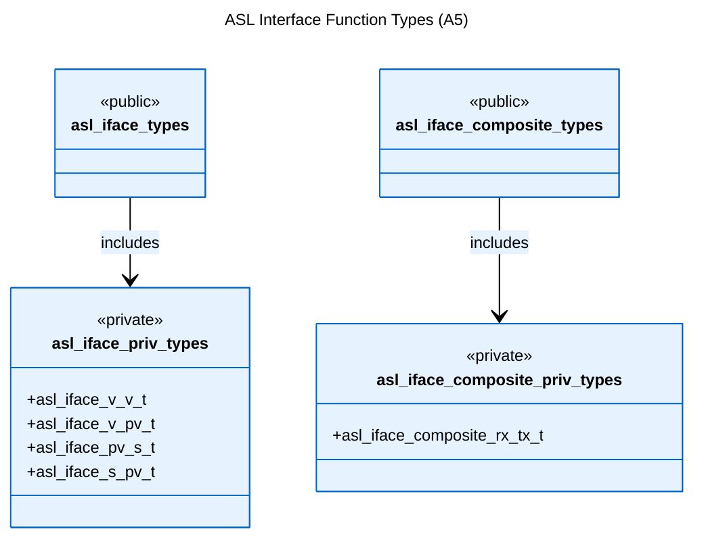
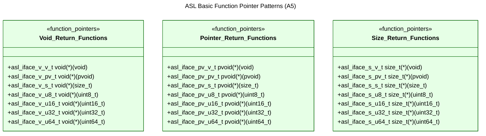

# Logical View: Interface Types

**Parent:** [Types System Hub](logical_view_types.md) | [Logical View](logical_view.md) | [Architecture Home](README.md)

## Table of Contents
- [1. Overview](#1-overview)
- [2. Interface Architecture](#2-interface-architecture)
- [3. Function Pointer Patterns](#3-function-pointer-patterns)
- [4. Public vs Private Interfaces](#4-public-vs-private-interfaces)
- [5. Pattern Classification](#5-pattern-classification)
- [6. Usage Examples](#6-usage-examples)
- [7. References](#7-references)

---

## 1. Overview

The ASL Interface Types module defines comprehensive function pointer patterns used throughout the library. These patterns provide type-safe callback mechanisms and enable flexible, pluggable component architectures.

**Key Features**:
- Systematic function pointer naming convention
- Complete coverage of parameter/return type combinations
- Public/private interface separation
- Type-safe callback mechanisms

---

## 2. Interface Architecture



---

## 3. Function Pointer Patterns

### 3.1 Naming Convention

ASL follows systematic naming: `asl_iface_[return]_[param]_t`

**Type Codes**:
- `v` = void, `pv` = pvoid, `s` = size_t, `ps` = psize_t
- `u8` = uint8_t, `pu8` = puint8_t, `u16` = uint16_t, `pu16` = puint16_t
- `u32` = uint32_t, `pu32` = puint32_t, `u64` = uint64_t, `pu64` = puint64_t

### 3.2 Basic Function Patterns



---

## 4. Public vs Private Interfaces

### 4.1 Public Interface Headers

**File**: `asl_iface_types.h`
```c
// Public interface - includes private implementation
#include "asl_iface_priv_types.h"

// This file enables EA UML delegate class usage
// Function pointer prototypes defined in private file
```

**File**: `asl_iface_composite_types.h`
```c
// Public composite interface - includes private implementation
#include "asl_iface_composite_priv_types.h"

// Composite function patterns for complex operations
```

### 4.2 Private Implementation Headers

**File**: `asl_iface_priv_types.h`
- Contains 320+ function pointer typedef definitions
- Systematic coverage of all return/parameter combinations
- Foundation for all interface patterns

**File**: `asl_iface_composite_priv_types.h`
- Specialized function patterns for composite operations
- Serial communication interfaces
- Buffer-based operations

---

## 5. Pattern Classification

**Coverage**: 320+ function pointer patterns for all return/parameter combinations.

**Common Patterns**:
- `asl_iface_v_v_t` - void(*)(void) - Simple callbacks
- `asl_iface_pv_s_t` - pvoid(*)(size_t) - Allocation patterns  
- `asl_iface_s_pv_t` - size_t(*)(pvoid) - Size query patterns
- `asl_iface_v_pv_t` - void(*)(pvoid) - Cleanup patterns

**Usage Examples**:
```c
// Allocator uses interface types
typedef struct asl_allocator_t {
    asl_iface_pv_s_t alloc_f;  // pvoid (*)(size_t)
    asl_iface_v_pv_t free_f;   // void (*)(pvoid)
} asl_allocator_t;

// Mutex uses interface types  
typedef struct asl_mutex_t {
    asl_iface_v_v_t lock_f;    // void (*)(void)
    asl_iface_v_v_t unlock_f;  // void (*)(void)
} asl_mutex_t;
```
---

## 6. Usage Examples

**Callback Registration**:
```c
asl_iface_v_pu8_t callback = my_data_handler;
register_callback(callback);
```

**Object Method Dispatch**:
```c
obj->init_f();  // Call initialization function pointer
obj->cleanup_f();  // Call cleanup function pointer
```

**Polymorphic Interface**:
```c
asl_processor_t* proc = get_processor();
proc->process_f(proc, data);  // Call through interface
```

---

## 7. References

### Implementation Files
- **Headers**: `asl_iface_types.h`, `asl_iface_priv_types.h`
- **Composite**: `asl_iface_composite_types.h`, `asl_iface_composite_priv_types.h`

### Related Documentation
- [Basic Types](logical_view_types_basic.md)
- [Composite Types](logical_view_types_composite.md)
- [Type System Hub](logical_view_types.md)
