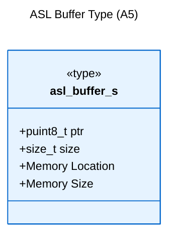
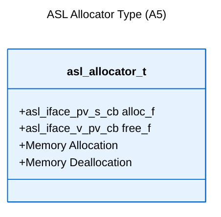

# Logical View: Memory Management Types

**Parent:** [Types System Hub](logical_view_types.md) | [Logical View](logical_view.md) | [Architecture Home](README.md)

## Table of Contents
- [1. Overview](#1-overview)
- [2. Buffer Type](#2-buffer-type)
- [3. Allocator Type](#3-allocator-type)
- [4. Usage Patterns](#4-usage-patterns)
- [5. References](#5-references)

---

## 1. Overview

The ASL Memory Management Types provide encapsulated abstractions for memory operations, combining basic types with interface patterns to create type-safe memory handling primitives.

**Key Features**:
- Bounded memory abstractions with size tracking
- Pluggable allocation strategies
- Type-safe memory operations
- Platform-independent implementations

---

## 2. Buffer Type

### 2.1 asl_buffer_s Structure

Encapsulated abstraction of bounded memory with location and size information:



**Implementation**:
```c
typedef struct asl_buffer_s {
    puint8_t ptr;    // Pointer to memory location
    size_t size;     // Size of pointed memory in bytes
} asl_buffer_s;
```

**Usage Characteristics**:
- **8-bit oriented**: Designed for byte-level operations
- **Bounds checking**: Size information enables safe operations
- **Generic container**: Used across all ASL data structures
- **Platform independent**: Works on any system with C99 support

### 2.2 Buffer Operations

**Initialization Pattern**:
```c
// Static buffer initialization
uint8_t static_memory[1024];
asl_buffer_s buffer = {
    .ptr = static_memory,
    .size = sizeof(static_memory)
};

// Dynamic buffer initialization
asl_buffer_s* create_buffer(size_t size) {
    asl_buffer_s* buf = malloc(sizeof(asl_buffer_s));
    buf->ptr = malloc(size);
    buf->size = size;
    return buf;
}
```

---

## 3. Allocator Type

### 3.1 asl_allocator_t Structure

Encapsulated abstraction of dynamic memory allocation:



**Implementation**:
```c
typedef struct asl_allocator_t {
    asl_iface_pv_s_cb alloc_f;  // pvoid (*)(size_t) - allocates memory
    asl_iface_v_pv_cb free_f;   // void (*)(pvoid) - releases memory
} asl_allocator_t;
```

**Function Signatures**:
- `alloc_f`: Allocates requested memory size, returns pointer or NULL
- `free_f`: Releases previously allocated memory, no return value

### 3.2 Allocator Implementations

**Standard malloc/free allocator**:
```c
asl_allocator_t std_allocator = {
    .alloc_f = malloc,
    .free_f = free
};
```

**Custom allocator implementation**:
```c
pvoid custom_alloc(size_t size) {
    // Custom allocation logic
    return allocated_memory;
}

void custom_free(pvoid ptr) {
    // Custom deallocation logic
}

asl_allocator_t custom_allocator = {
    .alloc_f = custom_alloc,
    .free_f = custom_free
};
```

---

## 4. Usage Patterns

### 4.1 Memory Operations Pattern

**Safe Buffer Operations**:
```c
// Buffer bounds checking
bool buffer_write_safe(asl_buffer_s* buf, size_t offset, 
                      const uint8_t* data, size_t len) {
    if (offset + len > buf->size) {
        return false;  // Would exceed buffer bounds
    }
    memcpy(buf->ptr + offset, data, len);
    return true;
}
```

### 4.2 Resource Management Pattern

**RAII-style Resource Management**:
```c
typedef struct managed_buffer_t {
    asl_buffer_s buffer;
    asl_allocator_t* allocator;
} managed_buffer_t;

managed_buffer_t* create_managed_buffer(size_t size, asl_allocator_t* alloc) {
    managed_buffer_t* mb = alloc->alloc_f(sizeof(managed_buffer_t));
    mb->buffer.ptr = alloc->alloc_f(size);
    mb->buffer.size = size;
    mb->allocator = alloc;
    return mb;
}

void destroy_managed_buffer(managed_buffer_t* mb) {
    mb->allocator->free_f(mb->buffer.ptr);
    mb->allocator->free_f(mb);
}
```

---

## 5. References

### Implementation Files
- **Header**: `asl/defs/asl_types.h` - Type definitions
- **Header**: `asl/defs/asl_pointer_types.h` - Pointer abstractions

### Related Modules
- [Basic Types](logical_view_types_basic.md) - Fundamental type definitions
- [Interface Types](logical_view_types_interface.md) - Function pointer patterns
- [CBUF Implementation](logical_view_cbuf.md) - Buffer usage example

### Design Patterns
- **Composition**: Combining basic types into higher-level abstractions
- **Strategy**: Pluggable allocator implementations
- **RAII**: Resource acquisition and cleanup patterns
