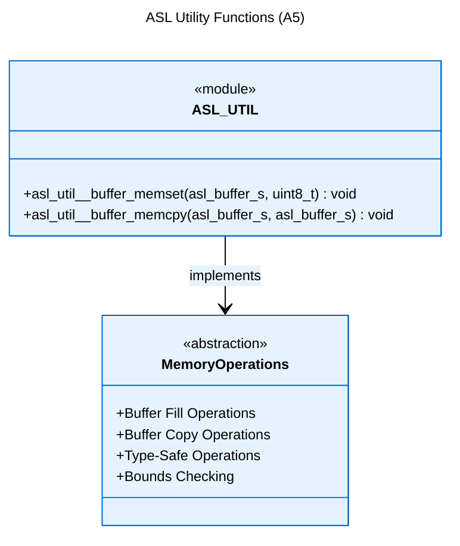

# Logical View: UTIL Overview & Core Functions

**Parent:** [Utilities Module Hub](logical_view_util.md) | [Logical View](logical_view.md) | [Architecture Home](README.md)

## Table of Contents
- [1. Overview](#1-overview)
- [2. Core Functions](#2-core-functions)
- [3. Memory Operations](#3-memory-operations)
- [4. References](#4-references)

---

## 1. Overview

The ASL Utility (UTIL) module provides essential helper functions and memory operations that support all other ASL modules. It implements type-safe wrappers around standard library functions with enhanced error checking and ASL-specific behavior.

**Key Features**:
- **Type-safe memory operations**: Buffer-aware memory functions
- **Enhanced error checking**: Parameter validation and bounds checking
- **ASL integration**: Optimized for ASL data structures
- **Cross-platform compatibility**: Consistent behavior across systems

**Design Philosophy**:
- Provide safe alternatives to standard library functions
- Enable consistent memory management patterns
- Support debugging and testing scenarios
- Maintain high performance with safety

---

## 2. Core Functions



**Function Categories**:
1. **Memory Fill Operations**: Safe buffer initialization
2. **Memory Copy Operations**: Bounds-checked data transfer
3. **Math Utilities**: Common mathematical operations
4. **Validation Helpers**: Parameter and state checking

---

## 3. Memory Operations

### 3.1 Buffer-Aware Operations

The UTIL module provides buffer-aware memory operations that integrate with ASL's type system:

**Type Integration**:
```c
// Uses asl_buffer_s for type safety - actual signatures from asl_util.h
void asl_util__buffer_memset(asl_buffer_s dest, uint8_t value);
void asl_util__buffer_memcpy(asl_buffer_s dest, asl_buffer_s src);
```

**Safety Features**:
- Automatic bounds checking
- NULL pointer validation
- Size constraint enforcement
- Buffer overlap detection

### 3.2 Performance Characteristics

**Optimized Operations**:
- Word-aligned memory access when possible
- Bulk transfer optimizations
- Cache-friendly access patterns
- Platform-specific optimizations

**Memory Layout Awareness**:
```
Buffer Operations:
[Header|Data.........|Unused]
         ^count bytes^
         
Bounds checking ensures:
- count <= buffer.size
- No buffer overruns
- Proper alignment
```

---

## 4. References

### Detailed Documentation
- [API Reference](logical_view_util_api.md) - Complete function documentation
- [Usage Patterns](logical_view_util_patterns.md) - Integration and design patterns

### Implementation Files
- **Header**: `asl/library/asl_util.h` - Function declarations
- **Source**: `asl/library/asl_util.c` - Implementation

### Related Modules
- [Types](logical_view_types.md) - ASL type system integration
- [CBUF](logical_view_cbuf.md) - Circular buffer usage
- [FIFO](logical_view_fifo.md) - Queue implementation usage
- [LIFO](logical_view_lifo.md) - Stack implementation usage
