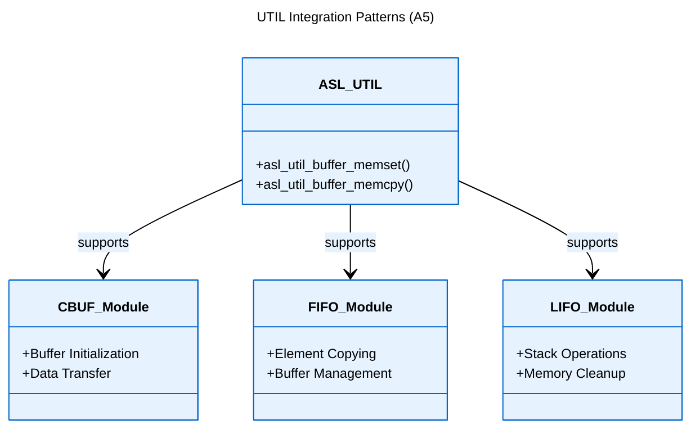

# Logical View: UTIL Usage Patterns

**Parent:** [Utilities Module Hub](logical_view_util.md) | [Logical View](logical_view.md) | [Architecture Home](README.md)

## Table of Contents
- [1. Integration Patterns](#1-integration-patterns)
- [2. Memory Management](#2-memory-management)
- [3. Common Use Cases](#3-common-use-cases)
- [4. References](#4-references)

---

## 1. Integration Patterns

### 1.1 Data Structure Integration



### 1.2 Buffer Initialization Pattern

```c
// Initialize data structure with pattern
asl_buffer_s buffer = { .ptr = memory, .size = size };
asl_util_buffer_memset(buffer, 0x00);  // Clear memory
```

### 1.3 Data Transfer Pattern

```c
// Safe buffer-to-buffer copy
asl_buffer_s source = { .ptr = src_mem, .size = src_size };
asl_buffer_s dest = { .ptr = dst_mem, .size = dst_size };
asl_util_buffer_memcpy(dest, source);
```

---

## 2. Memory Management

### 2.1 Security Patterns

**Memory Clearing**:
```c
// Clear sensitive data
asl_buffer_s sensitive = { .ptr = password_buffer, .size = pwd_len };
asl_util_buffer_memset(sensitive, 0x00);
```

**Debug Patterns**:
```c
// Fill with debug pattern
asl_buffer_s debug_buf = { .ptr = test_memory, .size = test_size };
asl_util_buffer_memset(debug_buf, 0xAA);  // Debug pattern
```

### 2.2 Validation Patterns

```c
// Verify buffer operations
bool validate_buffer_operation(asl_buffer_s* buf) {
    if (!buf || !buf->ptr || buf->size == 0) {
        return false;
    }
    return true;
}
```

---

## 3. Common Use Cases

### 3.1 Initialization Sequences

1. **Structure Setup**: Clear memory with `asl_util_buffer_memset`
2. **Data Population**: Copy initial data with `asl_util_buffer_memcpy`
3. **State Validation**: Verify buffer integrity

### 3.2 Cleanup Sequences

1. **Data Clearing**: Zero sensitive information
2. **Debug Patterns**: Fill with known values for testing
3. **Resource Release**: Prepare buffers for reuse

### 3.3 Performance Considerations

- **Batch Operations**: Process buffers in optimal sizes
- **Memory Alignment**: Ensure proper alignment for efficiency
- **Size Validation**: Check buffer bounds before operations

---

## 4. References

### Implementation Files
- **Header**: `asl/library/asl_util.h`
- **Source**: `asl/library/asl_util.c`

### Related Documentation
- [UTIL API Reference](logical_view_util_api.md)
- [UTIL Overview](logical_view_util_overview.md)
- [Data Structure Integration](logical_view.md)
