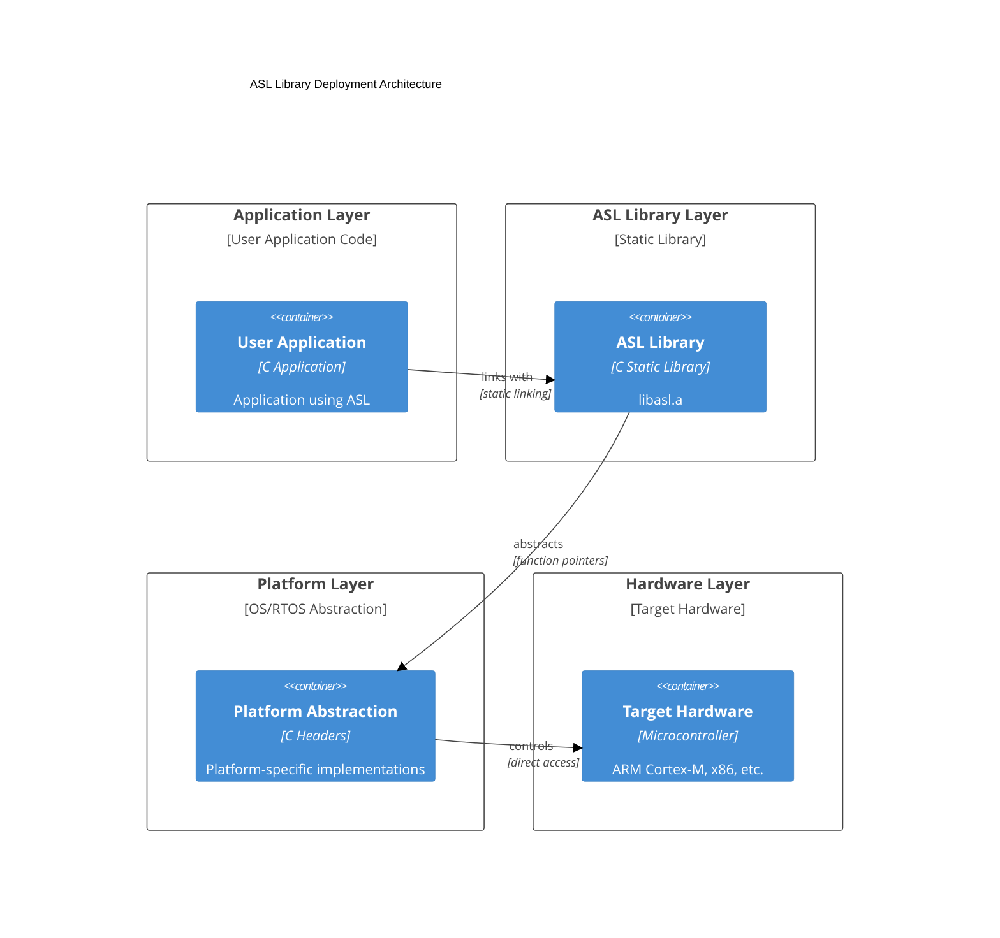
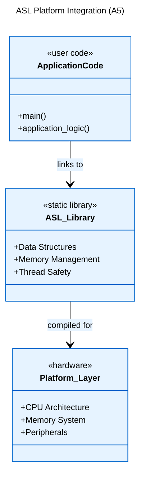
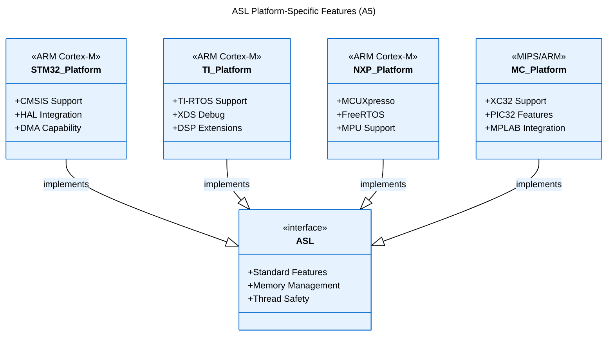

[Logical View](logical_view.md) | [Development View](development_view.md) | [Process View](process_view.md) | [Physical View](physical_view.md) | [Scenarios](scenarios.md)

---

# Physical View

## Table of Contents
- [1. Overview](#1-overview)
- [2. Deployment Architecture](#2-deployment-architecture)
- [3. Platform Integration](#3-platform-integration)
- [4. Resource Requirements](#4-resource-requirements)
- [5. Build Artifacts](#5-build-artifacts)
- [6. Platform-Specific Considerations](#6-platform-specific-considerations)
- [7. References](#7-references)

## 1. Overview

ASL deployment across different hardware platforms and integration with various microcontroller architectures.

## 2. Deployment Architecture

## 3. Platform Integration

## 4. Resource Requirements

**Memory**: Minimal ROM/RAM footprint, stack-aware design  
**CPU**: Standard ALU operations, optional atomic operations  
**Platform**: Optional mutex support for thread safety

## 5. Build Artifacts

For each supported platform, ASL produces:
- `libasl.a`: Static library
- Public API headers
- Type definitions

## 6. Platform-Specific Considerations

Platform Support: STM32, TI MCU, NXP, Microchip (ARM/MIPS architectures)

## 7. References

- Build System: `build_module.sh`, `build_all.sh`
- Platform Configurations: Toolchain setups in build scripts
- Resource Usage: Implementation files in `library/`
