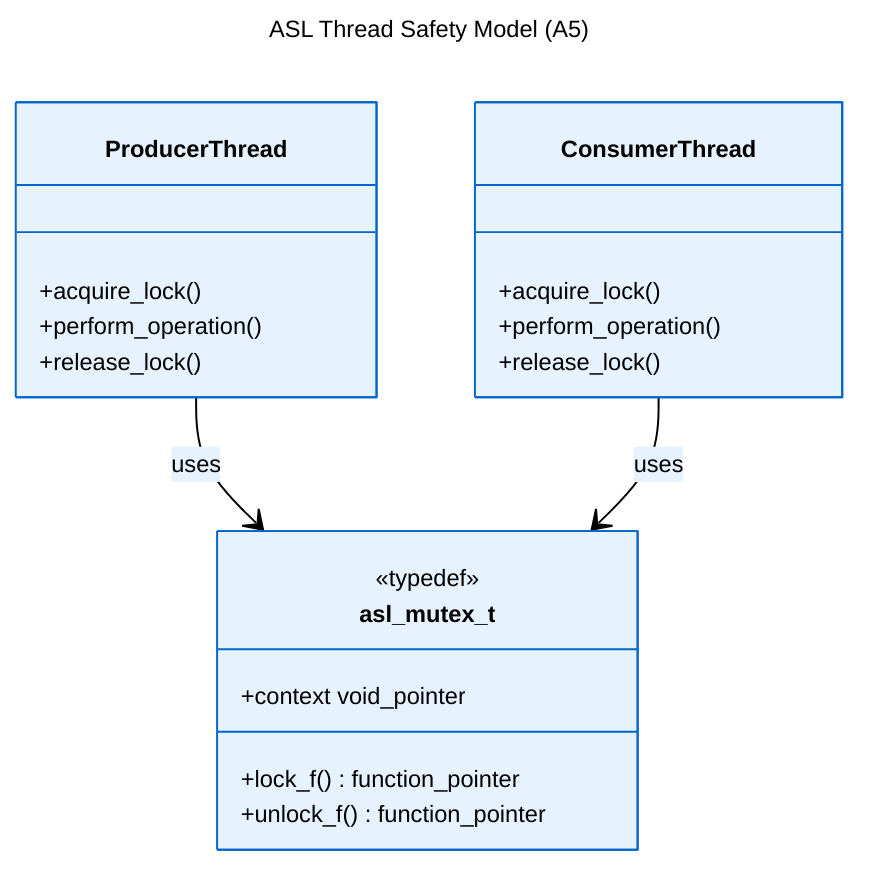
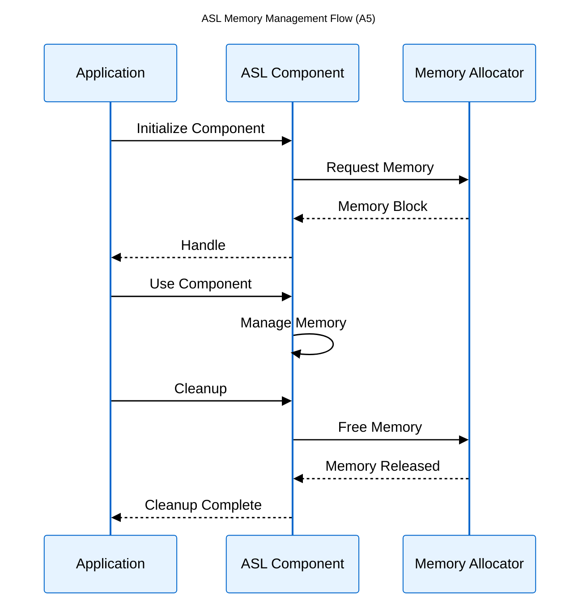
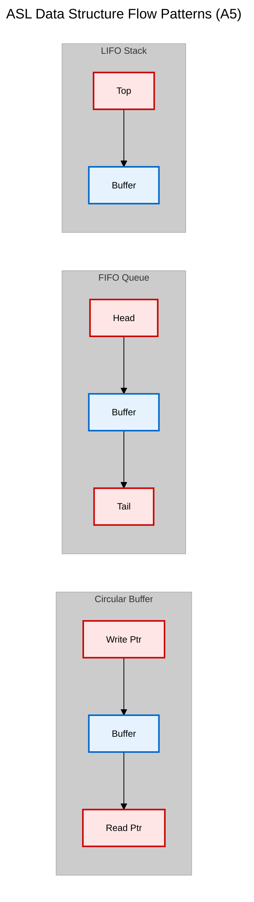
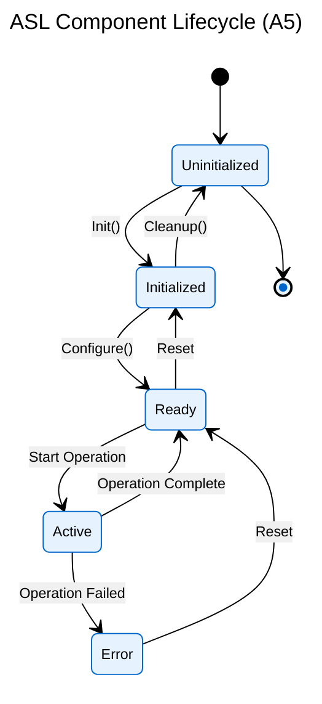

[Logical View](logical_view.md) | [Development View](development_view.md) | [Process View](process_view.md) | [Physical View](physical_view.md) | [Scenarios](scenarios.md)

---

# Process View

## Table of Contents
- [1. Overview](#1-overview)
- [2. Thread Safety Model](#2-thread-safety-model)
- [3. Memory Management](#3-memory-management)
- [4. Control Flow](#4-control-flow)
- [5. Data Flow](#5-data-flow)
- [6. State Management](#6-state-management)
- [7. References](#7-references)

---

## 1. Overview

Runtime behavior of ASL components, focusing on concurrency, memory management, and data flow patterns.

## 2. Thread Safety Model

ASL implements a producer-consumer thread safety model using the `asl_mutex_t` abstraction defined in `asl_types.h`. This model ensures:

1. **Thread Isolation**: Each data structure supports separate producer and consumer threads
2. **Critical Section Protection**: Operations are protected by mutex locks during critical sections
3. **Platform Independence**: The mutex implementation is abstracted through function pointers
4. **Lock Granularity**: Fine-grained locking at the operation level rather than object level

ASL implements thread safety through:
- Mutex abstraction (`asl_mutex_t`)
- Producer-Consumer pattern
- Atomic operations where needed
- Lock-free options for performance

## 3. Memory Management

## 4. Control Flow

Standard operation flow: Parameter validation → Resource check → Lock acquisition → Operation → Lock release → Result return.

## 5. Data Flow

## 6. State Management

Key States:
1. **Uninitialized**: Initial state
2. **Initialized**: Basic setup done
3. **Ready**: Configured for use
4. **Active**: Processing data
5. **Error**: Fault condition

## 7. References

### Implementation Files
- ASL Thread Safety: `asl_mutex_t` in `asl_types.h`
- Memory Management: `asl_allocator_t` in `asl_types.h`
- Data Structures: Implementation files in `library/`

### Related Views
- [Logical View](logical_view.md) - Component interfaces and APIs
- [Development View](development_view.md) - Code organization
- [Scenarios](scenarios.md) - Concrete threading examples

### Documentation Hub
- [Architecture Home](README.md) - Documentation structure and navigation
