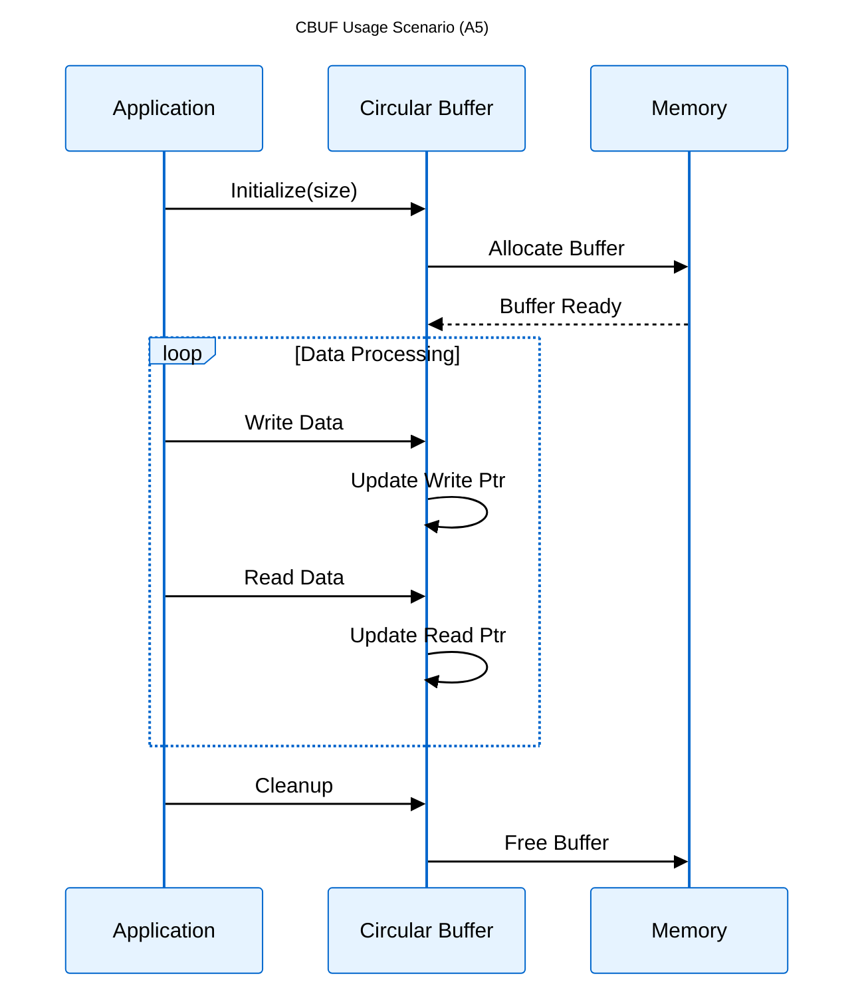
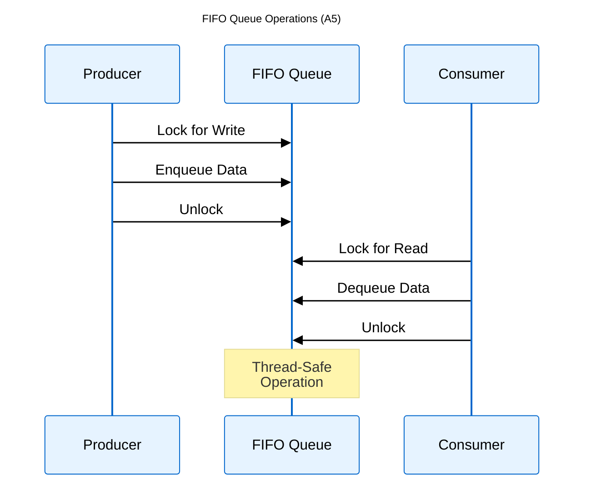
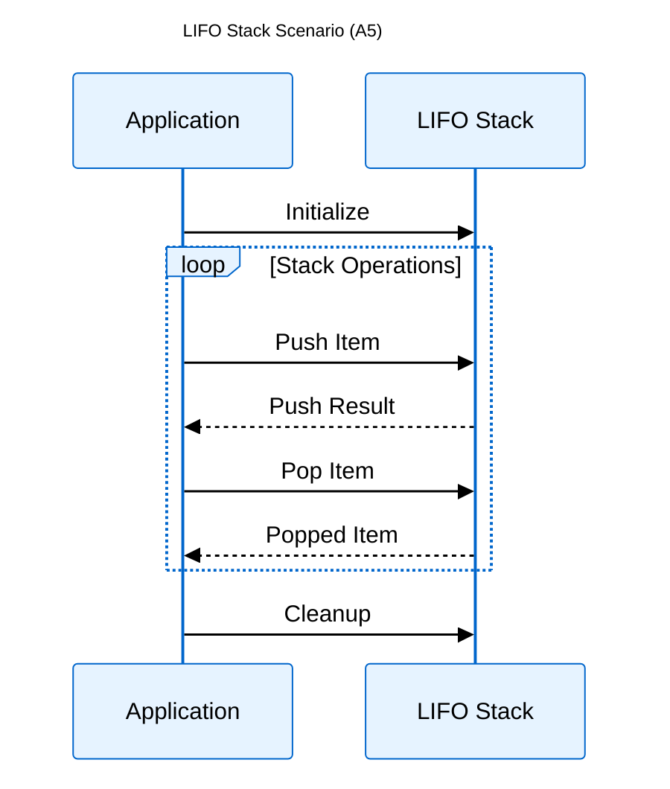
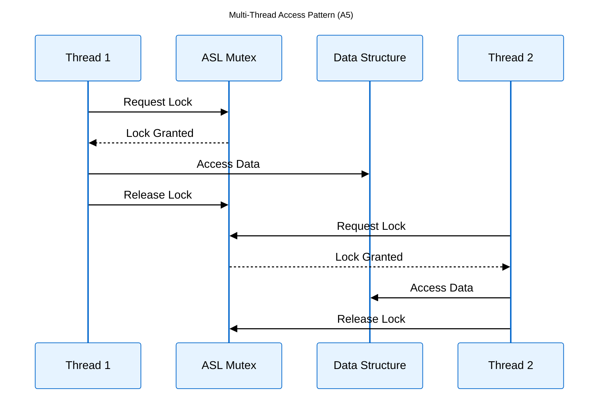
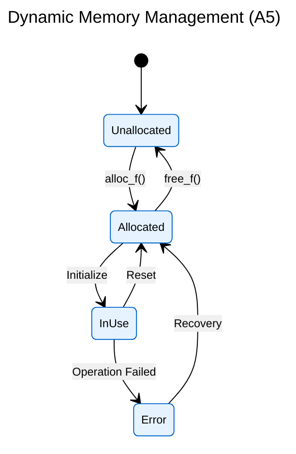
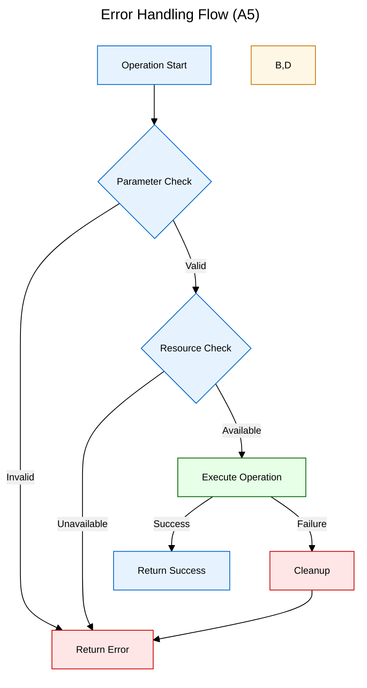
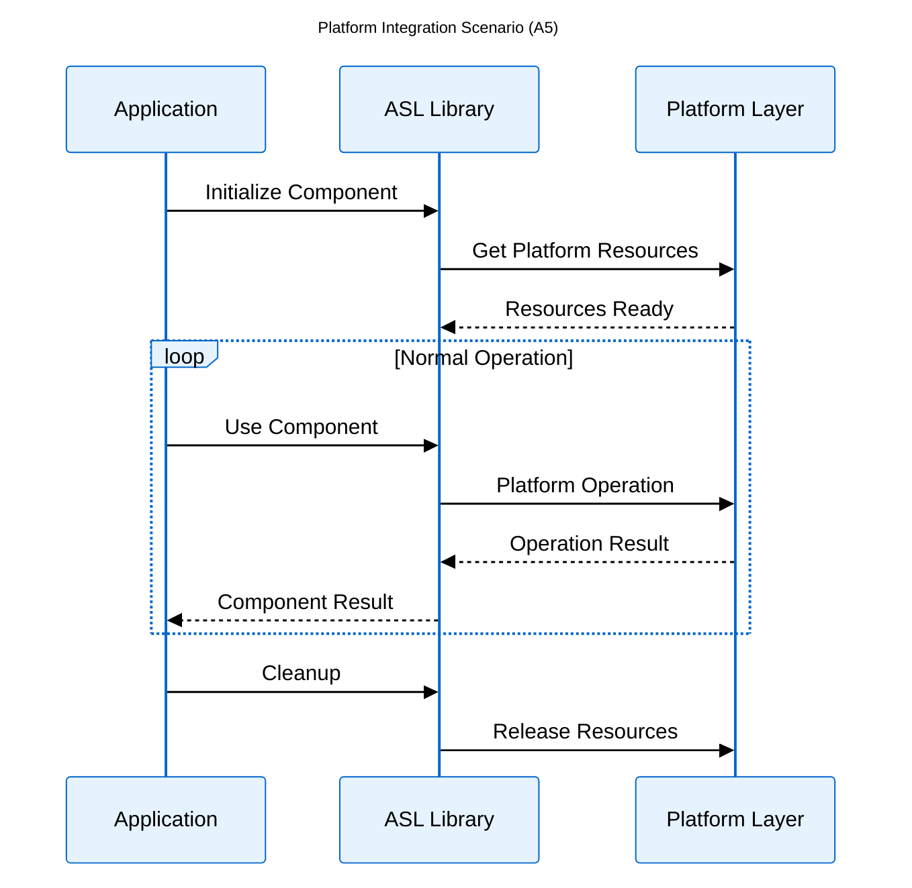

[Logical View](logical_view.md) | [Development View](development_view.md) | [Process View](process_view.md) | [Physical View](physical_view.md) | [Scenarios](scenarios.md)

---

# Scenarios View

## Table of Contents
- [1. Overview](#1-overview)
- [2. Data Structure Usage](#2-data-structure-usage)
- [3. Thread Safety Scenarios](#3-thread-safety-scenarios)
- [4. Memory Management](#4-memory-management)
- [5. Error Handling](#5-error-handling)
- [6. Platform Integration](#6-platform-integration)
- [7. References](#7-references)

---

## 1. Overview

Key usage patterns and interactions with ASL components through concrete examples.

## 2. Data Structure Usage

### 2.1 Circular Buffer Usage

### 2.2 FIFO Queue Operations

### 2.3 LIFO Stack Usage

## 3. Thread Safety Scenarios

### 3.1 Multi-Thread Access

## 4. Memory Management

### 4.1 Dynamic Allocation

## 5. Error Handling

## 6. Platform Integration

### 6.1 Cross-Platform Usage

## 7. References

- ASL API Documentation: Header files in `asl/defs/`
- Implementation Details: Source files in `asl/library/`
- Build Configuration: Platform-specific settings in `build_module.sh`
