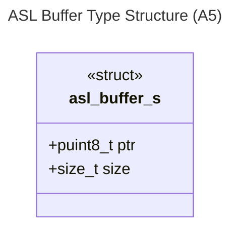
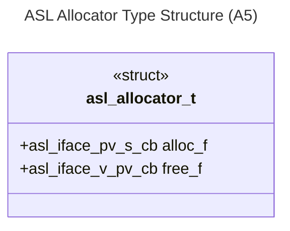
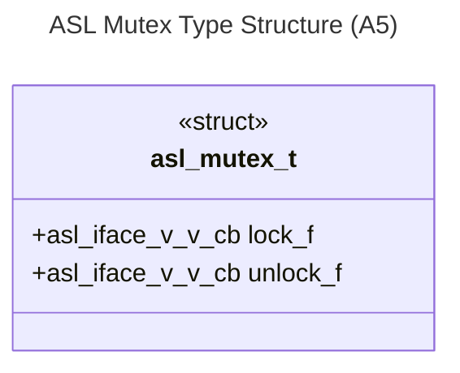
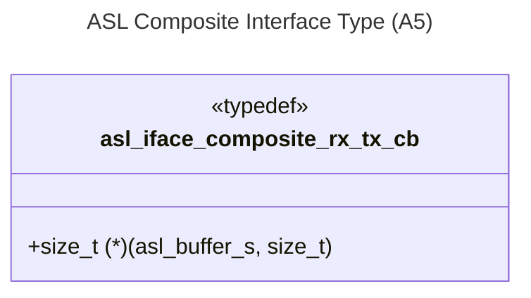

# Logical View: Composite Types

**Parent:** [Types System Hub](logical_view_types.md) | [Logical View](logical_view.md) | [Architecture Home](../index.md)

## 1. Overview

The ASL Composite Types module defines specialized data structures that combine basic types with interface patterns. These types provide higher-level abstractions for memory management and composite operations as defined in the actual codebase.

**Key Features**:
- Memory management composites (asl_buffer_s, asl_allocator_t)
- Thread synchronization primitives (asl_mutex_t)
- Composite interface patterns (asl_iface_composite_rx_tx_cb)
- Type dependency management

---

## 2. Core Composite Types

### 2.1 Memory Buffer Type (asl_buffer_s)

Encapsulated abstraction of bounded memory with location and size information:



**Implementation**:
```c
typedef struct asl_buffer_s {
    puint8_t ptr;    // Pointer to memory
    size_t size;     // Size of pointed memory
} asl_buffer_s;
```

### 2.2 Allocator Type (asl_allocator_t)

Encapsulated abstraction of dynamic memory allocation:



**Implementation**:
```c
typedef struct asl_allocator_t {
    asl_iface_pv_s_cb alloc_f;  // pvoid (*)(size_t) - allocates memory
    asl_iface_v_pv_cb free_f;   // void (*)(pvoid) - releases memory
} asl_allocator_t;
```

### 2.3 Mutex Type (asl_mutex_t)

Encapsulated abstraction of mutual exclusion primitives:



**Implementation**:
```c
typedef struct asl_mutex_t {
    asl_iface_v_v_cb lock_f;     // void (*)(void) - acquire lock
    asl_iface_v_v_cb unlock_f;   // void (*)(void) - release lock
} asl_mutex_t;
```

---

## 3. Composite Interface Types

### 3.1 Serial Communication Interface

Composite interface for buffer-based serial operations as defined in actual codebase:



**Implementation**:
```c
typedef size_t (*asl_iface_composite_rx_tx_cb)(asl_buffer_s buffer, size_t req);
```

---

## 4. References

### Implementation Files
- **Headers**: `asl_iface_composite_types.h`, `asl_iface_composite_priv_types.h`

### Related Modules  
- [Memory Types](logical_view_types_memory.md) | [Basic Types](logical_view_types_basic.md) | [Interface Types](logical_view_types_interface.md)

### Usage Examples
- **CBUF/LIFO/FIFO**: Use asl_buffer_s, asl_allocator_t, asl_mutex_t, and composite interfaces
