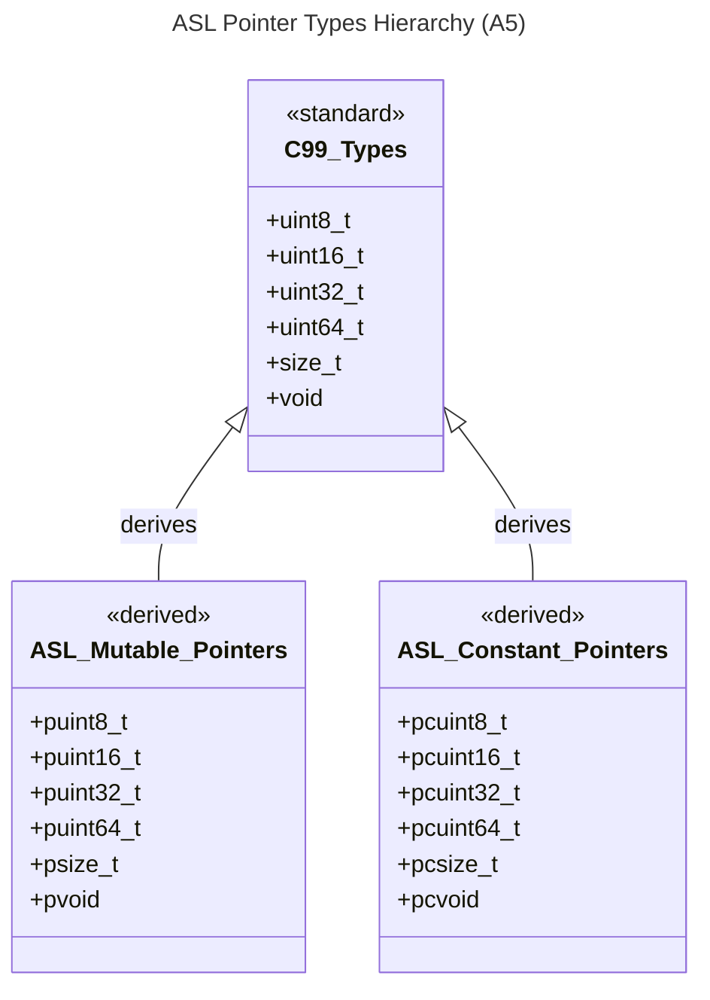

# Logical View: Basic & Pointer Types

**Parent:** [Types System Hub](logical_view_types.md) | [Logical View](logical_view.md) | [Architecture Home](../index.md)

## 1. Overview

The ASL Basic & Pointer Types module provides the foundation layer of the type system. It defines platform-independent pointer abstractions derived from C99 standard types, ensuring consistent memory management and type safety across the library.

**Key Features**:
- C99 standard compliance
- Platform-independent pointer abstractions
- Mutable and constant pointer variants
- Memory safety through type abstraction

---

## 2. Type Hierarchy



---

## 3. Basic C99 Types

ASL builds upon standard C99 types to ensure portability and compliance:

### 3.1 Core Types
**Standard**: uint8_t, uint16_t, uint32_t, uint64_t, size_t
**Source**: C99 headers (stdint.h, stddef.h)

### 3.2 Naming Convention
All pointer types follow consistent `p[c]type_t` pattern:
- **Mutable pointers**: `ptype_t` (puint8_t, psize_t, pvoid)
- **Constant pointers**: `pctype_t` (pcuint8_t, pcsize_t, pcvoid)

---

## 4. Pointer Type Categories

### 4.1 Mutable Pointers
**Pattern**: `ptype_t` where type can be modified through pointer
- `pvoid` - Pointer to void
- `psize_t` - Pointer to size_t
- `puint8_t` through `puint64_t` - Pointers to unsigned integers

### 4.2 Constant Pointers  
**Pattern**: `pctype_t` where pointed data is read-only
- `pcvoid` - Pointer to constant void
- `pcsize_t` - Pointer to constant size_t
- `pcuint8_t` through `pcuint64_t` - Pointers to constant unsigned integers

---

## 5. Constant Pointer Types

The constant pointer types provide read-only access to data, ensuring immutability through the type system:

**Implementation Pattern**:
```c
typedef const uint8_t* pcuint8_t;
typedef const void* pcvoid;
```

**Usage Context**: Function parameters where data should not be modified, configuration access, and immutable data structures.

---

## 6. Type Usage Patterns

**Standard Integration**: These types integrate seamlessly with ASL data structures
**Function Signatures**: Enable clear intent in API design 
**Memory Safety**: Support runtime bounds checking when combined with size information

---

## 7. Design Benefits

**Consistent Naming**: All pointer types follow p[c]type_t pattern
**Type Safety**: Clear distinction between mutable and constant pointers  
**Portability**: Abstract platform-specific implementations
**Memory Safety**: Enable bounds checking in higher-level abstractions

---

## 8. References

### Implementation Files
- **Header**: `asl_pointer_types.h`
- **Dependencies**: `stdint.h`, `stddef.h`

### Related Documentation
- [Interface Types](logical_view_types_interface.md)
- [Composite Types](logical_view_types_composite.md)
- [Type System Hub](logical_view_types.md)
